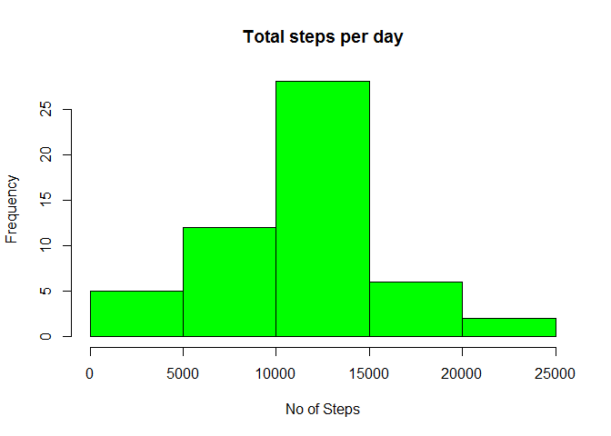

# Reproducible research assignment 1 on Activity monitoring data
Karin  
Sunday, May 17, 2015  
Loading and preprocessing the data

```r
setwd("C:/Users/Karin-PC/Downloads/repdata_data_activity")
data_complete <- read.csv("activity.csv")
library("dplyr")
```

```
## 
## Attaching package: 'dplyr'
## 
## The following object is masked from 'package:stats':
## 
##     filter
## 
## The following objects are masked from 'package:base':
## 
##     intersect, setdiff, setequal, union
```

What is mean total number of steps taken per day?
NOTE: In this dataset (x), NA's are excluded.
The code in the next chunk is excluding all rows where the steps <> 0 and
then group it my day to use in the summary when calculating the mean of the steps

```r
exNa <- filter(data_complete, steps >= 0)
by_day <- exNa %>% group_by(date)
y <- by_day %>% summarise(Ave.steps = mean(steps))
hist(y$Ave.steps, col = 'green', main = "Average steps per day", ylab = "Frequency", xlab = "Ave Steps")
```

 

```r
x <- median(y$Ave.steps, na.rm = FALSE)
print(x)
```

```
## [1] 37.37847
```
What is the average daily activity pattern?
This chunk of code is using the dataset, excluding the NA's, grouping it by interval into morning, midday or evening.
This grouping is then used to calculate the mean steps per interval

```r
data_excl <- mutate(exNa, TimeOfDay = ifelse(interval < 1200, "Morning", ifelse(interval >= 1200 & interval < 1800, "Midday", "Eve")))
by_cat <- data_excl %>% group_by(TimeOfDay, interval)
z <- by_cat %>% summarise(Ave.steps = mean(steps))
#add leading 0's
z <- mutate(z, int2 = sprintf("%04d", as.numeric(interval)))
z <- select(z, TimeOfDay, Ave.steps, int2)
library(ggplot2)
qplot(TimeOfDay, Ave.steps, data = z, color = TimeOfDay, ylab = "Average steps", xlab = "")
```

 

```r
by_int <- exNa %>% group_by(interval)
Ave <- by_int %>% summarise(Ave.steps = mean(steps))
#add leading 0's
Ave <- mutate(Ave, interval = sprintf("%04d", as.numeric(interval)))
Ave <- arrange(Ave, desc(Ave.steps))
q2 <- Ave[1,]
print(q2)
```

```
## Source: local data frame [1 x 2]
## 
##   interval Ave.steps
## 1     0835  206.1698
```

Inputing missing values
The strategy that is used to fill the missing values is based on the average per 5min interval.
Dataset temp is only collecting NA values from the complete dataset and then transformed to add the same columns as the dataset, excluding NA's to allow for a seamless merge later on.

```r
#Count no of missing values using complete dataset
testNA <- sum(is.na(data_complete$steps))
print(testNA)
```

```
## [1] 2304
```

```r
temp <- filter(data_complete, is.na(steps))
temp <- mutate(temp, interval = sprintf("%04d", as.numeric(interval)))
#Add average per 5min interval to missing step data
temp <- full_join(temp, Ave, by = "interval")
temp <- select(temp, date, interval, Ave.steps)
temp <- rename(temp, steps = Ave.steps)
temp <- mutate(temp, TimeOfDay = ifelse(interval < 1200, "Morning", ifelse(interval >= 1200 & interval < 1800, "Midday", "Eve")))
data_excl <- mutate(data_excl, interval = sprintf("%04d", as.numeric(interval)))
#Join NA and exclude NA data sets
all_data <- full_join(temp, data_excl, by = NULL)
```

```
## Joining by: c("date", "interval", "steps", "TimeOfDay")
```

```r
by_day2 <- all_data %>% group_by(date)
y2 <- by_day2 %>% summarise(Ave.steps = mean(steps))
par(mfrow = c(2, 1), mar = c(4, 4, 2, 1))
hist(y$Ave.steps, col = 'green', main = "Average steps per day - NA excluded", ylab = "Frequency", xlab = "")
hist(y2$Ave.steps, col = 'red', main = "Average steps per day - with mean values added", ylab = "Frequency", xlab = "Ave Steps")
```

 

Are there differences in activity patterns between weekdays and weekends?
Ensure that the date is in the correct format before the "DayofWeek" function were used to assign day of week and then use this to determine if its was a weekday or weekend.

```r
all_data <- mutate(all_data, date = as.Date(date))
all_data <- mutate(all_data, DayOfWeek = weekdays(date))
all_data <- mutate(all_data, day_tp = ifelse(DayOfWeek == "Sunday", "Weekend", ifelse(DayOfWeek == "Saturday", "Weekend", "Weekday")))
by_week <- all_data %>% group_by(day_tp, interval)
x <- by_week %>% summarise(Ave.steps = mean(steps))
    
library("lattice", lib.loc="C:/Program Files/R/R-3.2.0/library")
x$day_tp <- factor(x$day_tp) 
x$interval <- factor(x$interval)
xyplot(Ave.steps ~ interval | levels(day_tp), 
   data = x,
   type = "l",
   xlab = "Interval",
   ylab = "Average Number of steps",
   layout=c(1,2))
```

 
